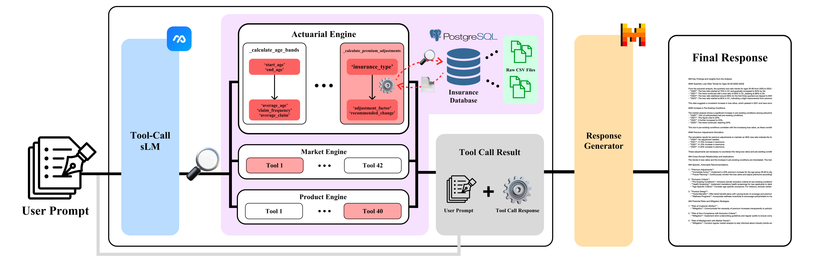
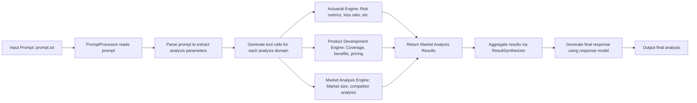

# APT (Actuarial Personalized Tool)-Based Tool-Call sLLM Agent Pipeline for Enhancing Efficiency in Insurance Actuarial Work
### 2025 DB Insurance & Finance Contest


## Overview

The Insurance Analysis Pipeline is an integrated solution designed to perform comprehensive analyses of insurance products. Combining actuarial assessments, product development strategies, and market analysis, the system delivers rigorous, reproducible, and validated insights into insurance products. The architecture emphasizes high-quality outputs through detailed quality metrics such as completeness, consistency, and reliability.

## Execution Workflow

The pipeline executes in the following major stages:

1. **Environment and Database Initialization (run_prompts.sh):**
   - Loads database configuration from a .env file (e.g., DB_HOST, DB_PORT, DB_NAME, DB_USER, etc.).
   - Forcefully stops any running PostgreSQL instances and cleans previous data directories to ensure a pristine starting state.
   - Initializes a new PostgreSQL database cluster using `initdb` and updates essential configuration files (including modifications to `listen_addresses` and `pg_hba.conf`).
   - Starts the PostgreSQL server and checks its readiness using `pg_isready`.
   - Creates the required database and executes an initial schema SQL script (e.g., `product_development_schema.sql`) to establish tables, views, and indices.
   - Executes preliminary queries to validate the database connection and display key business metrics (such as the number of insurance products, total policy counts, and aggregated risk premiums).
   - Activates the Conda environment (named "insurance") and adjusts the PYTHONPATH to include the project root.
   - Finally, runs the main application using `python process_prompts.py` and, upon completion, gracefully shuts down the PostgreSQL server.

2. **Prompt Processing and Analysis (process_prompts.py):**
   - **PromptProcessor Class:**
     - Reads and parses a prompt file (e.g., `prompt.txt`), splitting content into individual prompts using `[PROMPT]` markers.
     - Initializes critical components, including:
       - A tool model (`watt-tool-8B`) for generating tool calls necessary for insurance analysis requests.
       - A response model (`Mistral-Small-24B-Instruct-2501`) for synthesizing final analysis outputs.
       - A tokenizer, updated with special tokens (e.g., a PAD token with `mean_resizing=False`) to manage embedding initialization.
       - An instance of the Insurance Analysis Engine (`InsuranceEngine`) configured with database connectivity and domain-specific settings.
   - **Processing Pipeline:**
     - For each prompt, the system creates a series of validated tool calls to structure the insurance analysis request.
     - Executes these calls sequentially, handling distinct analysis domains such as actuarial evaluation, market analysis, and product assessment.
     - Aggregates the results from all tool calls and feeds them into the `generate_mistral_response` method, which produces a consolidated final output.
     - Computes qualitative and quantitative quality metrics (completeness, consistency, reliability) to validate and benchmark the analysis.
     - Stores the integrated results (including prompt identifiers, raw prompts, detailed domain analyses, quality metrics, execution statuses, and final responses) into a JSON file (`results.json`).

3. **Detailed Insurance Analysis (InsuranceEngine):**
   - Located in `src/core/engines/insurance.py`, the InsuranceEngine class is responsible for in-depth handling of insurance requests.
   - It validates incoming parameters, decomposes high-level prompts into specific sub-analyses (e.g., actuarial risk assessment, market positioning, product feasibility), and processes each domain accordingly.
   - Uses a dedicated module (ResultSynthesizer) to aggregate sub-analysis results into a cohesive and comprehensive final outcome.
   - Incorporates quantitative evaluations (e.g., RMSE, MAE, and other domain-specific measures) to ensure the robustness and reliability of the analysis.

## File Structure and Component Overview

The project is structured as follows:

```
├── run_prompts.sh         # Shell script for environment setup, database initialization, and pipeline execution.
├── process_prompts.py     # Main application for prompt processing and orchestration of analysis tasks.
└── src/core/engines/
    ├── base.py            # Base interface for analysis engines.
    ├── main.py            # Central engine coordinator.
    └── insurance.py       # Domain-specific module that processes detailed insurance analysis requests.
```

## Dependencies and Prerequisites

- Python 3.8 or higher
- PostgreSQL
- Conda environment management
- Essential Python libraries: pandas, numpy, datetime, among others required by the analysis models.

## Installation and Environment Setup

Before running the pipeline, perform the following setup steps:

1. Copy the example environment file to create a local configuration:
   ```bash
   cp .env.example .env
   ```
2. Create and activate the Conda environment:
   ```bash
   conda env create -f environment.yml
   conda activate insurance_analysis
   ```

## How to Run

1. Ensure that your `.env` file is correctly configured with the database settings (e.g., DB_HOST, DB_PORT, DB_NAME, DB_USER).
2. Execute the shell script:
   ```bash
   bash run_prompts.sh
   ```
   This script will:
   - Initialize a fresh PostgreSQL server cluster.
   - Set up the necessary database schema and perform initial connectivity checks.
   - Activate the configured Conda environment and adjust the PYTHONPATH.
   - Launch the main prompt processing application.
3. Upon completion, review the aggregated results in the generated `results.json` file.

## CLI Command Examples

The following are sample CLI commands to execute specific analyses:

- **Actuarial Analysis:**
  ```bash
  python process_prompts.py actuarial loss_ratio --claims 1000000 --premiums 1200000
  python process_prompts.py actuarial risk_metrics --historical_losses "[100000,120000,95000]"
  python process_prompts.py actuarial premium_adjustment --target_ratio 0.7
  ```

- **Product Development:**
  ```bash
  python process_prompts.py product coverage --type comprehensive --segment young_professionals
  python process_prompts.py product benefits --segment families
  python process_prompts.py product pricing --coverage_amount 100000000 --risk_level 1.2
  ```

- **Market Analysis:**
  ```bash
  python process_prompts.py market size --segment senior_citizens
  python process_prompts.py market competition --segment young_professionals
  python process_prompts.py market forecast --segment families
  ```

- **Integrated Analysis:**
  ```bash
  python process_prompts.py analyze --target young_professionals --coverage comprehensive --claims 1000000 --premiums 1200000
  ```

## Prompt Processing Flow Visualization

Below is a graphical representation of how the Insurance Analysis Engine processes an input prompt. If your Markdown viewer supports Mermaid, you can visualize the flowchart:



## Example Prompt Configuration

An example prompt configuration file (e.g., prompt.txt) may look like:

```
[PROMPT]
Please analyze the loss ratio for a policy with 1,200,000 in premiums and 1,000,000 in claims.
```

Additional configurations and prompt customizations can be added as needed.

## Model Specifications and References

- **Tool Model:** watt-tool-8B  
  For detailed specifications, refer to the [watt-tool-8B huggingface](https://huggingface.co/watt-ai/watt-tool-8B).

- **Response Model:** Mistral-Small-24B-Instruct-2501  
  More details are available at the [Mistral-Small-24B-Base-2501 huggingface](https://huggingface.co/mistralai/Mistral-Small-24B-Base-2501).

These models are seamlessly integrated to handle task-specific operations and provide high-fidelity outputs.

## Engine Details

The analysis pipeline is built on a modular engine framework, where each engine serves a distinct purpose:

- **Actuarial Engine:**
  - Focuses on quantitative risk assessments, including loss ratio calculations, risk metrics (such as Value at Risk and Expected Loss), and premium adjustments.

- **Product Development Engine:**
  - Handles the design and optimization of insurance products through coverage structure design, benefit analysis, and pricing strategy formulation.

- **Market Analysis Engine:**
  - Analyzes market dynamics by assessing market size, competitor analysis, demand forecasting, and market share computations.

- **Integrated Insurance Engine:**
  - Aggregates results from the individual engines to produce a comprehensive analysis. This engine validates data quality through metrics such as completeness, consistency, and reliability, ensuring robust final outputs.

## Data Setup and Configuration

### 1. Data Directory Structure
- Place all your data files in the `data/` directory
- Supported file formats: CSV, JSON, SQL dumps
- Example structure:
  ```
  data/
  ├── raw/                 # Raw data files
  │   ├── claims.csv
  │   ├── policies.csv
  │   └── customers.csv
  ├── processed/           # Processed/transformed data
  └── temp/               # Temporary files
  ```

### 2. Database Configuration
- The current `example.sql` contains sample schema and data
- **Important:** Replace `example.sql` with your actual data processing SQL scripts
- Required modifications:
  - Update table schemas to match your data structure
  - Modify data insertion statements
  - Adjust indexes and constraints as needed
  - Update views and stored procedures if necessary

Example of replacing `example.sql`:
```sql
-- Original example.sql
CREATE TABLE example_policies (...);

-- Should be replaced with actual implementation
CREATE TABLE policies (
    policy_id VARCHAR(50) PRIMARY KEY,
    customer_id VARCHAR(50),
    product_type VARCHAR(100),
    premium DECIMAL(15,2),
    start_date DATE,
    end_date DATE,
    -- Add other necessary fields
    FOREIGN KEY (customer_id) REFERENCES customers(customer_id)
);
```

### 3. Data Processing Implementation
The `process_insurance_data.py` provides a template for processing insurance data and loading it into the PostgreSQL database. This template needs to be customized according to your specific data structure and requirements.

#### Key Components:
- **InsuranceDataProcessor Class:**
  ```python
  class InsuranceDataProcessor:
      def process_quarterly_contracts(self) -> pd.DataFrame:
          # Process quarterly insurance contract data
          pass

      def process_quarterly_claims(self) -> pd.DataFrame:
          # Process quarterly insurance claims data
          pass

      def process_age_based_contracts(self) -> pd.DataFrame:
          # Process age-based contract data
          pass
  ```

#### Implementation Steps:
1. **Configure Data Sources:**
   - Update file paths in `data/` directory
   - Modify category mappings in `category_mapping` dictionary
   - Adjust database connection parameters

2. **Customize Data Processing:**
   - Implement the TODO sections in each processing method
   - Match your CSV column names with database table structure
   - Add any additional data transformation logic

3. **Example Usage:**
   ```python
   processor = InsuranceDataProcessor()
   
   # Process and load contracts data
   contracts = processor.process_quarterly_contracts()
   processor.save_to_db(contracts, 'quarterly_insurance_contracts')
   
   # Process and load claims data
   claims = processor.process_quarterly_claims()
   processor.save_to_db(claims, 'quarterly_insurance_claims')
   ```

4. **Database Integration:**
   - Ensures compatibility with schema defined in `example.sql`
   - Uses efficient bulk loading with `psycopg2.copy_from`
   - Includes error handling and transaction management

#### Note:
The provided template is designed to work with the example schema in `example.sql`. When implementing your own data processing logic, ensure that the output DataFrame columns match your actual database table structure.

### Expected Data Structure

The system expects the following data files:
1. Claims by amount data
2. Claims by period data
3. Health insurance premium data
4. Claims by quarter data
5. Contracts by quarter data
6. Product returns and fees data
7. Contracts by age data

Each file should contain the corresponding columns as mapped in `KOREAN_TO_ENGLISH_COLUMNS`.

### Insurance Data Processing Implementation Details

The `process_insurance_data.py` file contains several TODO items that need to be implemented:

1. **Category Mappings:**
   ```python
   self.category_mapping = {
       'category_1': 'type_a',
       'category_2': 'type_b',
       'category_3': 'type_c'
   }
   ```
   - Replace with your actual insurance category mappings
   - Ensure consistency with your data structure
   - Map all possible categories in your data

2. **Quarterly Contracts Processing:**
   ```python
   def process_quarterly_contracts(self) -> pd.DataFrame:
   ```
   - Implement data loading from your contracts file
   - Map columns according to your schema
   - Handle any data transformations needed
   - Expected columns: year, insurance_category, q1_contracts, q1_premium, etc.

3. **Quarterly Claims Processing:**
   ```python
   def process_quarterly_claims(self) -> pd.DataFrame:
   ```
   - Implement data loading from your claims file
   - Map columns according to your schema
   - Handle any data transformations needed
   - Expected columns: year, insurance_category, q1_accident_count, q1_claims, etc.

4. **Age-based Contracts Processing:**
   ```python
   def process_age_based_contracts(self) -> pd.DataFrame:
   ```
   - Implement age group data restructuring
   - Process data according to defined age groups
   - Handle aggregations if needed
   - Expected columns: contracts_under_10, risk_premium_under_10, etc.

5. **Claims by Period Processing:**
   ```python
   def process_claims_by_period(self) -> pd.DataFrame:
   ```
   - Implement period-based claims processing
   - Map columns according to your schema
   - Handle any time-based aggregations
   - Expected columns: within_1year_incidents, within_1year_claims, etc.

6. **Claims by Amount Processing:**
   ```python
   def process_claims_by_amount(self) -> pd.DataFrame:
   ```
   - Implement amount-based claims processing
   - Map columns according to your schema
   - Handle any amount range aggregations
   - Expected columns: under_10m_incidents, under_10m_claims, etc.

7. **Health Insurance Premium Processing:**
   ```python
   def process_health_insurance_premium(self) -> pd.DataFrame:
   ```
   - Implement health insurance premium data processing
   - Extract monthly data
   - Handle regional and type-based aggregations
   - Expected columns: region, type, year, month, premium

### Implementation Guidelines

1. **Data Validation:**
   - Add input data validation
   - Check for required columns
   - Validate data types
   - Handle missing values appropriately

2. **Error Handling:**
   - Add proper error handling for file operations
   - Handle data transformation errors
   - Log errors appropriately
   - Implement graceful fallbacks

3. **Performance Optimization:**
   - Use efficient data processing methods
   - Implement batch processing for large datasets
   - Optimize memory usage
   - Consider using parallel processing for large files

4. **Testing:**
   - Add unit tests for each processing function
   - Test with sample data
   - Validate output data structure
   - Test error handling

## Model Setup

1. Download the required models:
```bash
python download_model.py
```

2. Update the model paths in `.env`:
```
MODEL_PATH=path/to/your/model
RESPONSE_MODEL_PATH=path/to/your/response/model
```

## Usage

1. Prepare your prompts in `prompt.txt`
2. Run the analysis:
```bash
python process_prompts.py
```

## License

See LICENSE file.
